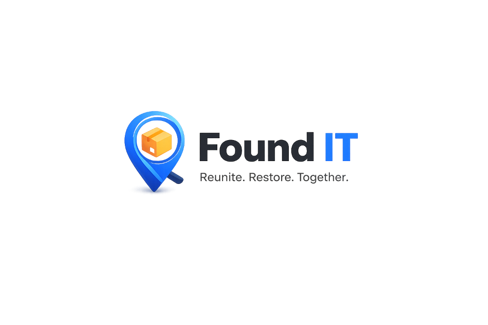

# Found IT

### 🔍 Reuniting People. Together.

*A modern community-powered Lost & Found platform built with Flask, PostgreSQL, and Google OAuth.*

 

---

# 📖 Overview

**Found IT** is a full-stack Lost & Found web platform that helps communities reconnect people with their belongings.

Unlike traditional lost-and-found boards, Found IT supports two complete recovery workflows:

- 📦 Claiming a found item
- 🤝 Returning a lost item

The platform also includes activity tracking, request management, secure contact sharing, Google authentication, image uploads, and a production-ready PostgreSQL deployment.

---

# ✨ Features

## 👤 Authentication

- Google OAuth Login
- Email & Password Login
- Secure Session Management
- Protected Dashboard

---

## 📦 Item Management

- Post Found Items
- Post Lost Items
- Upload Images
- Categories
- Community Selection
- Search & Filters
- Item Details Modal

---

## 🔄 Recovery Workflow

### Found Item

Owners can:

- Submit ownership proof
- Upload supporting images
- Track request status

Posters can:

- Review incoming claims
- Approve or reject claims
- Securely share contact information

---

### Lost Item

Finders can:

- Notify the owner that they have found the item
- Describe identifying details
- Upload supporting evidence

Posters can:

- Review return requests
- Approve or reject requests
- Connect securely with the finder

---

## 📋 Activity System

Every important action is logged, including:

- Posted Found Item
- Posted Lost Item
- Claim Submitted
- Return Request Submitted
- Claim Approved
- Claim Rejected
- Contact Requested
- Contact Shared

---

## 📬 Request Management

Dedicated request dashboard featuring:

- Claim Requests
- Return Requests
- Status Tracking
- Request History

---

## 🔒 Contact Privacy

Phone numbers are never public.

Contact details are exchanged only after:

- Request approval
- Explicit permission from the other user

---

## 🗄 Database

Supports two database engines automatically.

### Development

- SQLite

### Production

- Supabase PostgreSQL

The application automatically switches between both environments without requiring code changes.

---

# 🛠 Tech Stack

| Category | Technology |
|-----------|------------|
| Backend | Flask |
| Frontend | HTML, CSS, JavaScript |
| Database | SQLite & PostgreSQL |
| Authentication | Google OAuth & Local Authentication |
| Database Layer | Custom SQL |
| File Uploads | Flask |
| Deployment | Render |
| Database Hosting | Supabase |
| Version Control | Git & GitHub |

---

### ⭐ If you found this project interesting, consider giving it a star!

Built with ❤️ using Flask, PostgreSQL & Supabase

